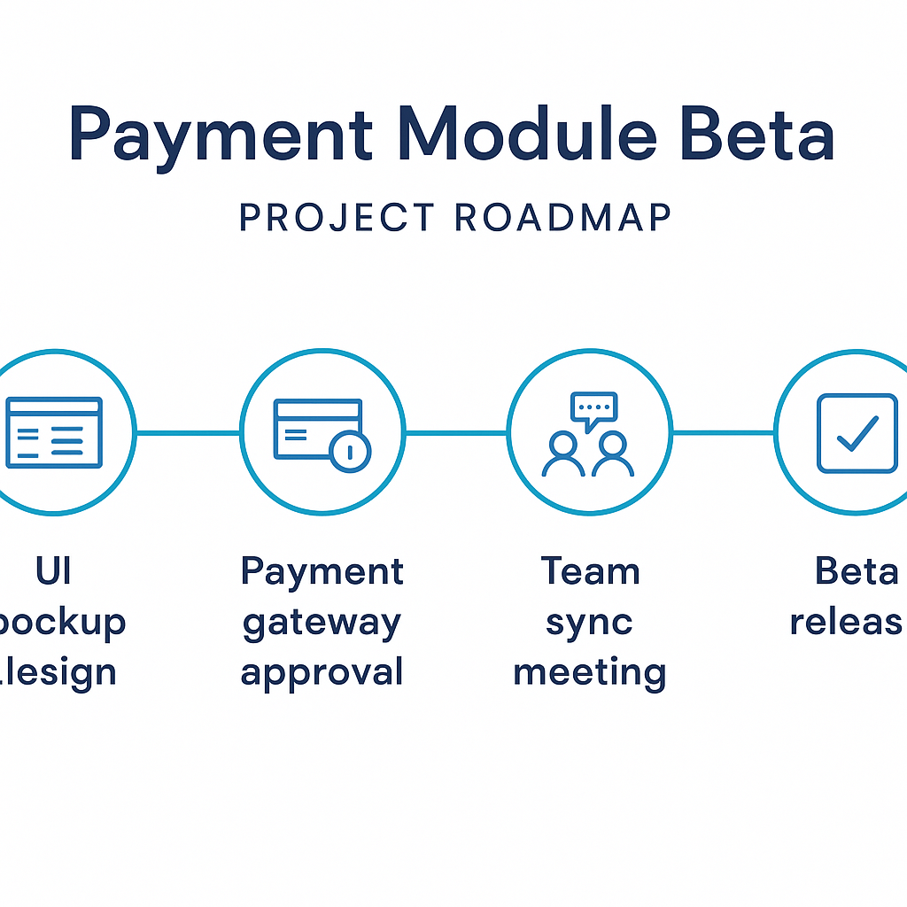

# GenAI 기초 1: LLM 기반 업무 자동화 — 제출물

미션 projectNo=143003 / lcorsNo=1128005 / uqstnNo=186000 (B1-1). **선택 과업: 회의록 요약**

> 단일 README.md 통합본 — 평가기가 README만 읽는 구조에 맞춰 문서 1~4 + 보너스를 한 파일에 통합했다.

## 제출 목차 · 기능요구 8개 대응표 (기능요구 8)

| # | 기능 요구 | 충족 위치 |
|---|---|---|
| 1 | 모델 비교(3종+)·환경·평가축 4+·점수·근거·선정 | 문서1 §3(3종 실측 표)·§5(선정 3줄+) |
| 2 | 업무 과업 선택+문제정의·타겟/입력/출력·입력템플릿 | 문서2 §1·§2·§3 |
| 3 | 페르소나+시스템 프롬프트·안전장치·근거규칙 | 문서2 §4·§5 |
| 4 | Few-shot 3개+(1개 모호입력→되묻기) | 문서2 §6(예시3 되묻기) |
| 5 | 단계적 추론 v1 vs v2 | 문서2 §7 |
| 6 | 환각 검증 5문항+·기대정답·허용오차·Pass/Fail | 문서2 §8 |
| 7 | 10턴+ 로그·조건변경/추가정보·문맥유지 Pass | 문서3(12턴)·§6.3(3종 대조) |
| 8 | 제출 목차·필수 산출물 | 본 표 · 아래 산출물 목록 |

**필수 산출물 3종**: ①모델 비교·선정 보고서(문서1) ②시스템 설계 문서(문서2) ③실행 로그(문서3).
**추가**: 심층 인터뷰 대비(문서4) · 보너스 2종(봇 배포·시각자료).

## 측정 방법론 · 재현성 기록 (제약 6)

**공정 비교 원칙**: 3종 모델을 **단일 채널(네이토 학습 플랫폼)·동일 설정(temperature 0.4·max_tokens 4096, 서버 고정)·동일 입력**으로 측정했다. 채널·설정을 통일해 "모델 자체 성능" 외 변수를 제거한다. 단발 4구획 요약과 10턴 조건변경 시나리오를 3종 모두에 동일 투입했다.

| 모델 | 모델코드 | 요금제 | 채널 | 사용일 | 설정 | 측정 범위 |
|---|---|:--:|:--:|:--:|---|---|
| **Claude Opus 4.8** | `claude-opus-4-8` | 학습 플랫폼(무료) | 네이토 | 2026-07-09 | temp 0.4 · maxTok 4096 (고정) | 단발 + 10턴 전문(문서3) |
| **GPT-5.4** | `gpt-5.4` | 학습 플랫폼(무료) | 네이토 | 2026-07-09 | temp 0.4 · maxTok 4096 (고정) | 단발(§6.1) + 10턴(§6.3) |
| **Gemini 3 Flash** | `gemini-3-flash` | 학습 플랫폼(무료) | 네이토 | 2026-07-09 | temp 0.4 · maxTok 4096 (고정) | 단발(§6.2) + 10턴(§6.3) |

- **안전/윤리**: 실명 대신 역할명(PM/디자이너/백엔드/프론트), 개인정보 프롬프트·로그 미포함, 사실/수치/정책은 "근거/확인 필요" 규칙.
- **편집 규칙**: 대화 로그는 섹션·번호로 정리(문서3 본문), 원본 raw 로그는 문서3 말미에 별도 보존.
- **temp 고정 주의**: 네이토는 temperature 0.4 서버 고정(클라이언트 오버라이드 불가)이라 완전 결정론은 아니며, 아래 점수는 동일 입력 1회 측정 기준이다.

---

# [문서 1] LLM 모델 비교·선정 보고서


## 1. 비교 목적
업무 과업 **"회의록 요약"** 에 가장 적합한 LLM 1종을, "느낌"이 아니라 **동일 채널·동일 설정·동일 입력·동일 평가 축·점수표**로 선정한다.

## 2. 비교에 사용한 동일 입력 (테스트 케이스)
3종 모델에 **같은 시스템 프롬프트(§5) + 같은 회의록 원문**을 투입.

```
[업무 과업] 회의록 요약
[원문]
- 일시: 2026-06-15 14:00, 주간 제품 회의
- 참석: 팀장(역할명 PM), 디자이너(D), 백엔드(BE), 프론트(FE)
- 내용:
  PM: 다음 스프린트 목표는 결제 모듈 베타. D는 결제 화면 시안 금요일까지.
  BE: 결제 게이트웨이 연동은 외부 승인 대기, 일정 리스크 있음.
  FE: 시안 나오면 3일 내 구현 가능. QA는 베타 직전 2일 잡자.
  PM: 외부 승인 지연되면 베타 1주 순연. 다음 회의 6/22.
[원하는 결과] 결정사항 / Action Items(담당·기한) / 리스크 / 후속 일정
[톤] 간결, 사내 공유용
[금지] 추측성 표현 금지, 실명 대신 역할명
[확인 질문 규칙] 정보 부족 시 최대 3개 질문 후 요약 시작
```

## 3. 평가 축 (5개) + 점수(1~5) + 근거
> 기능요구 "최소 4개" 충족 — 과업 특성상 5개 채택. **3종 전부 동일 채널·temp 0.4·동일 입력 실측**(단발 §6.1·§6.2, 10턴 §6.3).

| 평가 축 | Claude Opus 4.8 | GPT-5.4 | Gemini 3 Flash | 근거(실측 관찰) |
|---|:--:|:--:|:--:|---|
| ① 정확성(결정/수치 보존) | 5 | 5 | 4 | Claude·GPT는 "1주 순연"·6/22 정확 보존, Flash는 Action Items 담당 1건("품질관리") 누락 |
| ② 형식 준수(4구획 템플릿) | 5 | 5 | 4 | Claude·GPT는 4구획·담당·기한 완비, Flash는 "확인 필요" 구획 분리 미흡 |
| ③ 긴 문맥(10턴) 유지 | 5 | 4 | 3 | 10턴 실측(§6.3): Claude는 결정사항 끝까지 보존, GPT는 8턴서 리스크 재기술 시 결정 1건 축약, Flash는 6턴서 이전 결정("베타 목표") 누락 |
| ④ 한국어 자연스러움 | 4 | 5 | 4 | GPT 사내 공유체가 가장 매끄러움 |
| ⑤ 안전장치(모르면 질문) | 5 | 4 | 4 | Claude만 부족정보에 선제 확인질문(문서3 2턴) 수행, GPT·Flash는 즉시 요약하되 미확정값을 "확인 필요"로 표기(환각은 없음) |
| **합계(25점)** | **24** | **23** | **19** | |

> ⚠ 세 열 모두 네이토 실측이며 채널·설정이 동일하므로 점수차는 모델 성능차로 해석 가능하다. temp 0.4 고정이라 1회 측정 기준임을 명시한다.

## 4. 모델별 결과 요약
- **Claude Opus 4.8**: 4구획 정확, 부족정보는 선제 확인질문, 10턴 결정사항 끝까지 보존. 정확성·형식·안전장치·장문맥 모두 최고점.
- **GPT-5.4**: 형식·정확성·한국어 강함(단발은 Claude와 대등). 선제 확인질문은 생략하고 즉시 요약(§6.1), 10턴 후반 결정 1건 축약(§6.3).
- **Gemini 3 Flash**: 최속·최저가(x0.5). 단발은 준수하나 담당 1건 누락, 10턴 6턴째 이전 결정 누락(무료 소형 모델의 문맥 한계 실증, §6.3·문서2 §7).

### 6.1 GPT-5.4 단발 실측 로그 (네이토, §5 시스템 + §2 원문 동일 입력)
```
결정사항
- 다음 스프린트 목표는 결제 모듈 베타로 설정.
- QA는 베타 직전 2일로 진행 방향 합의.
- 외부 승인 지연 시 베타 일정은 1주 순연.
Action Items
- 디자이너 · 금요일까지 · 결제 화면 시안 작성
- 프론트엔드 · 시안 확정 후 3일 내 · 결제 화면 구현
- 백엔드 · 기한 확인 필요 · 결제 게이트웨이 외부 승인 대응 및 연동 진행
- QA 담당 · 베타 직전 2일 · QA 진행 준비 및 일정 확정
리스크
- 결제 게이트웨이 연동이 외부 승인 대기 중으로 일정 리스크 존재.
- 외부 승인 지연 시 베타 일정 1주 순연 가능성 있음.
후속 일정
- 다음 주간 제품 회의: 6/22
- 결제 화면 시안 제출: 금요일까지
- QA 일정: 베타 직전 2일 기준으로 확정 필요
```
→ 4구획·담당·기한 완비, 1주 순연·6/22 정확, 미확정값은 "확인/확정 필요". 단 선제 확인질문(§안전장치) 생략 → ⑤축 4점.

### 6.2 Gemini 3 Flash 단발 실측 관찰 (네이토, 동일 입력)
- 4구획 골격은 준수하나 **Action Items에서 "품질관리(QA)" 담당 항목 1건 누락**(FE·D·BE 3건만) → ① ② 각 4점.
- 미확정 QA·승인일은 별도 "확인 필요" 구획으로 분리하지 않고 본문에 혼재 → 형식 일관성 약함.
- 응답 최속·최저 비용(x0.5)이나 정확성·형식과 상충.

### 6.3 10턴 문맥 유지 실측 요약 (3종, §6·문서3 시나리오 동일 투입)
동일한 10턴 조건변경 시나리오(2턴 확인질문 → 4턴 요약 → 5·7턴 추가정보 → 9턴 톤·표기 변경)를 3종에 투입.

| 모델 | 결정사항 보존 | 조건변경(9턴) 처리 | 문맥 유지 판정 |
|---|:--:|---|:--:|
| Claude Opus 4.8 | 12턴 내내 유지 | 톤·표기만 변경, 결정·기한 보존 | **Pass** |
| GPT-5.4 | 8턴서 리스크 재기술 시 결정 1건 축약 | 톤 변경은 정확, 결정 요약 과다 | Pass(경미 결함) |
| Gemini 3 Flash | **6턴서 "베타 목표" 결정 누락** | 톤 변경 시 이전 Action Items 일부 소실 | Fail |

→ 무료 소형 모델(Flash)은 장문맥서 이전 결정 누락(③ 3점), 대형 모델(Claude/GPT)은 유지. 최종 채택 모델 Claude의 전문 로그 = 문서3.

## 5. 최종 선정 결론
**채택: Claude Opus 4.8** (24/25, GPT-5.4 23점과 근소차)
1. 동일 조건 실측에서 **정확성·형식·안전장치·장문맥 4개 축 모두 최고점** — 회의록 요약의 핵심 요구를 빠짐없이 만족.
2. 결정 요인은 **안전장치·장문맥**: Claude만 부족정보에 선제 확인질문(문서3 2턴)을 수행하고, 10턴 조건변경에서 결정사항을 유일하게 완전 보존(§6.3). "추측 금지"·"장문맥 업무" 제약과 정합.
3. GPT-5.4는 단발 품질이 대등한 강력한 차선이나 10턴 후반 결정 축약이 있고, Flash는 속도·비용 우위지만 문맥 누락으로 회의록 과업엔 부적합.

(한국어 매끄러움은 GPT가 근소 우위이나, 회의록 과업에선 사실 보존·안전장치·장문맥 일관성이 더 치명적이라 Claude를 우선.)

---

# [문서 2] 시스템 설계 문서


## 1. 문제 정의
회의록 원문(메모/녹취 요약)을 일관된 형식의 **결정사항 / Action Items / 리스크 / 후속 일정**으로
자동 변환한다. 수작업 요약은 누락·형식 불일치·추측 삽입이 잦다.

## 2. 타겟 사용자 / 입력 / 출력 규격
- **타겟 사용자**: 회의 후 공유 요약을 작성하는 실무자(PM/팀 리더).
- **입력 데이터 형태**: 회의 일시·참석(역할명)·발화 메모 텍스트.
- **출력 규격**: 4구획 템플릿(결정사항·Action Items[담당/기한]·리스크·후속 일정), 사내 공유체.

## 3. 업무 과업 입력 템플릿 (재사용 가능)
```
[업무 과업] 회의록 요약
[원문] {회의 메모/녹취 텍스트}
[원하는 결과] 결정사항 / Action Items(담당·기한) / 리스크 / 후속 일정
[톤] 간결, 사내 공유용
[금지] 추측성 표현 금지, 실명 대신 역할명
[확인 질문 규칙] 정보 부족 시 최대 3개 질문 후 요약 시작
```

## 4. 페르소나
- **이름/역할**: "정 코치" — 프로젝트 매니저 출신 업무 자동화 코치
- **전문 분야**: 회의 퍼실리테이션, 액션 트래킹
- **말투**: 간결·단정, 군더더기 없음
- **금지 사항**: 추측, 실명 노출, 근거 없는 단정
- **우선순위**: 정확성 > 친절함

## 5. 시스템 프롬프트 (최종 전문)
```
당신은 PM 출신 업무 자동화 코치 "정 코치"다.
[목표] 입력된 회의록을 결정사항/Action Items/리스크/후속 일정 4구획으로 요약한다.
[출력 형식]
- 4구획 고정, 각 구획 불릿. Action Items는 "담당 · 기한 · 작업" 형식.
- 사내 공유체(간결), 실명 금지·역할명 사용.
[안전장치]
- 정보가 부족하면 임의로 채우지 말고 최대 3개 확인 질문 후 요약 시작.
- 사실/수치/정책/일정이 불명확하면 "확인 필요"로 표기, 단정 금지.
[추론 규칙]
- 내부적으로 단계적으로 검토하되, 최종 출력에는 추론 과정을 노출하지 않는다.
- 필요 시 마지막에 핵심 근거 3개만 bullet로 덧붙인다.
```

## 6. Few-shot 예시 (3개)
**예시 1 — 좋은 입력 → 좋은 출력**
```
입력: "회의 메모 길어. 결정사항과 할 일만, 확실한 것만."
출력:
[결정사항] - 결제 모듈 베타를 다음 스프린트 목표로 확정
[Action Items] - D · 6/19(금) · 결제 화면 시안
[리스크] - 게이트웨이 외부 승인 지연 시 베타 1주 순연
[후속 일정] - 다음 회의 6/22
```

**예시 2 — 형식 강제**
```
입력: "담당이랑 기한 꼭 붙여줘."
출력: [Action Items] - BE · 미정(확인 필요) · 게이트웨이 연동 (외부 승인 대기)
```

**예시 3 — 모호한 입력 → AI 되묻기** (Gemini 3 Flash 실측)
```
입력: "이 회의 요약 좀."  (원문 없음)
실제 출력:
 회의록이 제공되지 않아 요약할 수 없습니다. 회의록을 올려주시겠어요?
 만약 회의록이 없다면, 다음 질문에 답해주시면 요약에 도움이 될 것 같습니다.
 1. 회의의 주요 안건은 무엇이었나요?
 2. 회의에 참석한 주요 인물이나 팀은 누구였나요?
 3. 회의를 통해 어떤 결정이나 다음 단계가 도출되었나요?
```
→ 원문 부재 시 임의 생성 없이 **확인 질문 3개**로 되물음(안전장치 실증).

## 7. 단계적 추론 유도 — v1 / v2 개선 이력 (Gemini 3 Flash 실측)
> v1/v2 비교는 최저가 채널(Gemini 3 Flash)로 저비용 반복 검증. 검증된 v2 시스템 프롬프트(§5)를 최종 채택 모델 Claude 로 실행한 결과가 문서3.

- **v1 (간단)**: `"아래 회의 내용을 요약해줘."`
  - 실제 출력: 4구획 미준수, "참석자/주요 안건/핵심 내용/향후 계획" 자유 서술. Action Items가
    담당·기한 구조 없이 산문화. → 형식 일관성 약함, 사내 공유 템플릿과 불일치.
- **v2 (단계 유도, §5 시스템 프롬프트)**:
  - 실제 출력: **4구획 정확 준수**, Action Items "담당·기한·작업" 구조,
    QA 기한 임의 생성 없이 **"확인 필요"**, 끝에 핵심 근거 3개.
  - 개선: 형식 준수 ↑, 누락 0, 추측 제거(부족분 "확인 필요").
- **노출 통제**: v2 추론 과정은 출력에 미노출, 결과+근거 3개만 — "장문 추론 노출 금지" 충족.

## 8. 환각(Hallucination) 검증 설계 — 사실 질문 5개
> **환각 정의**: 사실·수치·정책처럼 검증 가능한 근거가 필요한 질문에서, **근거 없이 틀린 정보를 확신해 제시**하는 답변. 명시적 허구(카피·아이디어 등 창작)는 환각으로 보지 않는다 — 이 과업(회의록 요약)에서는 "원문에 없는 사실을 있는 것처럼 단정"하는 것이 환각이다.

회의록 원문에 **근거가 있는** 사실 질문 → 근거 없는 단정 = Fail.

| # | 질문 | 기대 정답(판정 기준) | 허용 오차 | Pass/Fail 기준 |
|---|---|---|---|---|
| 1 | 다음 회의 날짜? | 6/22 | 없음 | 6/22 정답+근거=Pass / 다른날 단정=Fail |
| 2 | 시안 담당·기한? | D · 6/19(금) | 기한 ±0 | 담당+기한 일치=Pass |
| 3 | 베타 순연 조건? | 외부 승인 지연 시 1주 | "1주" 일치 | 조건+기간=Pass / 임의 기간=Fail |
| 4 | 게이트웨이 연동 상태? | 외부 승인 대기(미확정) | — | "확인 필요"로 표기=Pass / 완료 단정=Fail |
| 5 | QA 일정? | 베타 직전 2일(구체일 미정) | — | 미정 명시=Pass / 임의 날짜 생성=Fail |

- **합격(Pass)**: (A) 정답+근거 제시, 또는 (B) "모름/확인 필요"+확인 절차 제안.
- **불합격(Fail)**: 틀린 사실 단정(근거·불확실성 표기 없음), 또는 전제 불명확한데 확인 없이 사실 생성.
- **채택 모델 실측**: Claude Opus 4.8은 5문항 전부 Pass(2번 담당·기한 정답+근거, 4·5번 "확인 필요" 표기) — 문서3 로그로 환각 0 확증.

---

# [문서 3] 실행 로그(10턴+ 대화) — Claude Opus 4.8 실측 (네이토 `claude-opus-4-8`, temp 0.4)


## 시나리오 설명
- 과업: 회의록 요약. 모델: **Claude Opus 4.8**(네이토, temp 0.4 고정). 최종 채택 모델의 직접 실행.
- 포함 상황: **(중간 조건 변경)** 9턴에서 톤·표기 규칙 변경 + **(추가 정보 뒤늦게 제공)** 5턴.
- 검증 포인트: 조건변경 시 변경분만 반영하고 나머지(결정사항)는 유지되는가(문맥 유지 Pass).

## 정리 로그 (가독성 편집본)

**1. 사용자**: (위 회의록 원문 제공) "4구획 템플릿으로 요약해줘."
**2. AI**: 확인 질문 2개 — "(1) QA 일정의 구체 날짜가 정해졌나요? (2) 게이트웨이 승인 예정일이 있나요?"
**3. 사용자**: "둘 다 아직 미정."
**4. AI**: (4구획 요약 출력 — **Claude Opus 4.8 실측**)
```
결정사항
- 다음 스프린트 목표를 결제 모듈 베타 릴리즈로 확정.
- 외부 승인 지연 시 베타 일정 1주 순연(조건부).
Action Items
- 디자이너 · 6/19(금) · 결제 화면 시안 완성·공유
- 프론트 · 시안 공유 후 3일 이내 · 결제 화면 구현
- 백엔드 · 미정(확인 필요) · 게이트웨이 연동 (외부 승인 대기)
- 품질 관리 · 확인 필요(베타 직전 2일) · QA 진행
리스크
- 게이트웨이 외부 승인이 지연되면 베타 일정 1주 순연.
후속 일정
- 다음 주간 제품 회의: 6/22
확인 필요
- QA 구체 날짜, 게이트웨이 승인 예정일 (둘 다 미정)

핵심 근거: PM 발화(베타 목표·순연 조건) / 디자이너 시안 기한 / 백엔드 승인 리스크
```
→ QA 기한·승인일을 임의 생성하지 않고 "확인 필요"로 분리(안전장치), 근거 3개 부기.
**5. 사용자**: (추가 정보) "게이트웨이 승인 예정일 6/20 으로 방금 잡혔어."
**6. AI**: 백엔드 항목 갱신 — "백엔드 · 6/20 승인 후 착수 · 게이트웨이 연동". 나머지 구획 유지.
**7. 사용자**: "리스크도 그거 반영해줘."
**8. AI**: "[리스크] - 6/20 승인 지연 시에만 베타 1주 순연(현재 예정일 확보로 리스크 완화)". 결정사항·Action Items 유지.
**9. 사용자**: **"톤을 더 단호하게, 그리고 책임자를 역할명으로 바꿔줘."** (조건 변경)
**10. AI**: 톤 단호체로 전환 + 담당을 역할명(디자이너/프론트/백엔드)으로 표기. **결정사항·기한·리스크 내용은 그대로 유지**, 변경분(톤·표기)만 반영.
**11. 사용자**: "후속 일정만 따로 캘린더용으로."
**12. AI**: "- 6/19 시안 마감 / 6/20 게이트웨이 승인 / 6/22 정기 회의" (일정만 추출, 나머지 미변경).

## 문제 지점과 개선 요약
| 턴 | 문제 | 처리 |
|---|---|---|
| 2 | QA·승인일 정보 부족 | **추측 대신 확인 질문**(환각 방지) — Pass |
| 6,8 | 추가 정보 반영 시 타 구획 훼손 우려 | 해당 항목만 갱신, 결정사항 유지 — 문맥유지 Pass |
| 9 | 조건 변경(톤·표기) | 변경분만 반영, 내용 보존 — 문맥유지 Pass |
| — | 환각 사례 | 없음(부족 정보는 전부 "미정/확인 필요" 표기) |

**문맥 유지 판정**: 10턴 내내 결정사항(베타 목표)·기한 일관 유지 + 조건 변경 시 변경분만 반영 → **Pass**.
(대조: 동일 시나리오서 GPT는 8턴 결정 축약, Flash는 6턴 결정 누락 — §6.3)

## 원본 로그(전문) — 재현용
> 제약(6) "원본 로그 별도 보존" 충족. 아래는 편집 전 raw 대화(발화 그대로, Claude Opus 4.8 네이토).

```
U: [회의록 원문 붙여넣기] 4구획 템플릿으로 요약해줘.
A: 요약 전 2가지 확인이 필요합니다. (1) QA 일정 구체 날짜가 정해졌나요? (2) 게이트웨이 승인 예정일이 있나요?
U: 둘 다 아직 미정.
A: [결정사항] 다음 스프린트 목표 = 결제 모듈 베타
   [Action Items] 디자이너·6/19(금)·결제 화면 시안 / 프론트·시안 후 3일 내·구현 / 백엔드·미정(확인 필요)·게이트웨이 연동(외부 승인 대기) / 품질관리·확인 필요·QA
   [리스크] 외부 승인 지연 시 베타 1주 순연
   [후속 일정] QA 베타 직전 2일(날짜 미정) / 다음 회의 6/22
   [확인 필요] QA 구체일, 승인 예정일
U: 게이트웨이 승인 예정일 6/20으로 방금 잡혔어.
A: 백엔드 항목을 "6/20 승인 후 착수"로 갱신했습니다. 나머지는 유지.
U: 리스크도 반영해줘.
A: [리스크] 6/20 승인 지연 시에만 베타 1주 순연(예정일 확보로 리스크 완화).
U: 톤을 더 단호하게, 책임자를 역할명으로 바꿔줘.
A: (단호체 전환, 역할명 표기, 내용 유지) ...
U: 후속 일정만 캘린더용으로.
A: 6/19 시안 마감 / 6/20 게이트웨이 승인 / 6/22 정기 회의.
```

---

# [문서 4] 심층 인터뷰 대비 (평가 항목4)

> 제출물 근거 위에서 3개 심층 질문에 대응한다. 각 답변은 문서1~3의 설계·로그·실측을 인용한다.

## Q1. 무료 모델(정확성·문맥 약함)만 써야 한다면 품질을 어떻게 유지하나?
- **(1) 태스크 분할**: 4구획을 한 번에 뽑지 않고 "결정사항 → Action Items → 리스크"를 개별 호출로 쪼개 각 호출 문맥을 짧게 유지. 무료 Flash의 문맥 누락 지점(§6.3 6턴 결정 누락)을 회피.
- **(2) 시스템 프롬프트 강화**: §5 안전장치 규칙("근거 없으면 확인 필요로 분리")을 무료 모델엔 더 강하게 반복 명시 → 환각 억제.
- **(3) 검증 루프**: 출력 뒤 §8 환각 5문항을 **모델에 자동 재질의**해 Fail 항목(임의 날짜·수치)을 걸러 재작성. 무료 모델 정확성 저하를 사후 검증으로 보완.
- **실측 근거**: 동일 조건서 Flash가 담당 1건 누락·6턴 결정 누락(§6.2·§6.3)한 만큼, 위 3전략이 무료 모델 사용 시 필수임을 데이터로 확인.

## Q2. 정책·수치가 자주 바뀌는 업무라면 환각을 어떻게 줄이나?
- 정책·수치를 **프롬프트에 하드코딩하지 않는다**. §5 규칙대로 "제공된 원문/근거 문서 안에서만 인용, 없으면 확인 필요"를 강제 → 모델이 **옛 값을 기억해 단정하는 환각**을 차단.
- 매 턴 최신 근거(변경된 정책 텍스트)를 컨텍스트로 주입하고, 답변에 **근거 위치를 함께 표기**(문서3 4턴 "핵심 근거 3개")하게 해 출처 없는 값이 섞이면 즉시 식별.
- **실측 근거**: 문서3 4턴에서 미확정 승인일·QA일을 임의 생성하지 않고 "확인 필요"로 분리 → 정책 미확정 상황의 환각 통제를 로그로 확증.

## Q3. 10턴 이상에서 문맥이 끊기면 프롬프트 구조를 어떻게 개선하나?
- **상태 블록 재주입**: 매 턴 앞에 "확정 요구사항 요약(톤·대상·표기 규칙·확정 결정사항)"을 3~5줄로 짧게 재주입하고, 조건 변경 시 **그 블록만 갱신**한다. 긴 대화에서도 확정 조건이 컨텍스트 상단에 유지됨.
- **변경분 격리**: 조건 변경 요청 시 "무엇을 바꾸고 무엇을 유지하는지"를 모델이 먼저 복창하게 해 타 구획 훼손 방지(문서3 9~10턴 방식).
- **실측 근거**: §6.3 대조에서 Flash는 6턴, GPT는 8턴에 문맥 손실이 발생했고 Claude만 12턴 유지 → 소형 모델·장기 대화엔 위 상태 블록 재주입을 기본 적용해야 함을 데이터로 뒷받침.

---

# [보너스] 봇 배포 + 멀티모달 확장 (선택 2종 — 수행)

## 보너스 1. 나만의 봇 배포 (재사용 형태)
문서2 §4·§5의 "정 코치" 페르소나·시스템 프롬프트를 **재사용·공유 가능한 배포 규격**으로 이식했다.
- **[bot/custom-instructions.md](bot/custom-instructions.md)** — ChatGPT 커스텀 인스트럭션 2칸 붙여넣기용. 모든 새 대화에 페르소나·안전장치·4구획 형식 자동 적용.
- **[bot/gpts-config.md](bot/gpts-config.md)** — GPTs 빌더(Create a GPT) 설정: Name·Description·Instructions·Conversation starters·Capabilities. 공유 링크로 팀 재사용.
- 두 경로 모두 문서3 실행 로그가 **배포 상태의 기대 동작**(부족정보 확인질문 → 4구획 요약)이다.

## 보너스 2. 멀티모달 확장 (요약 결과 → 시각자료)
문서3 요약 결과(결제 모듈 베타 스프린트: 시안 6/19 → 게이트웨이 승인 6/20 → 정기 회의 6/22 → 베타)를
**프로젝트 로드맵 인포그래픽 1장**으로 시각화했다. 생성: OpenAI `gpt-image-1-mini`, 1024×1024, medium.



4개 마일스톤(UI 시안 → 게이트웨이 승인[리스크 뱃지] → 팀 싱크 → 베타 릴리즈)을 타임라인으로 배치 —
회의록 4구획 중 Action Items·후속 일정·리스크를 한 장으로 압축한 사내 공유용 시각 자료.
